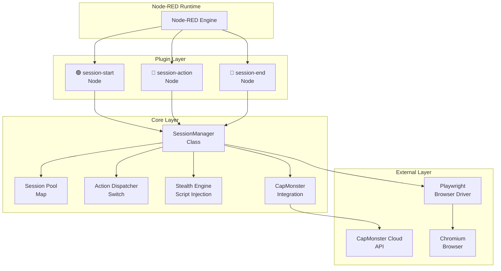

<!-- Инструкция: этот файл сгенерирован автоматически. Строго следуй этим правилам: - Не добавляй ничего от себя. - Не используй выдуманные данные. - Используй только то, что реально есть в репо. - Соблюдай структуру и стиль предыдущих файлов. - Не меняй формат и стиль без необходимости. - Пиши сухо, технически, по делу. -->

# System Architecture: node-red-contrib-playwright-js

## 📋 Архитектурный обзор

| Компонент | Назначение | Реализация |
|-----------|------------|------------|
| **Тип архитектуры** | Plugin-based для Node-RED | Node.js модуль |
| **Основная парадигма** | Session-based browser automation | 3 специализированные ноды |
| **Управление состоянием** | In-memory session storage | SessionManager class |
| **Взаимодействие** | Flow-based визуальное программирование | Node-RED runtime |

## 🏗️ Высокоуровневая архитектура

### Основная структура
```
Node-RED Runtime
├── node-red-contrib-playwright-js Plugin
│   ├── 🟢 playwright-session-start (Node)
│   ├── 🔵 playwright-session-action (Node) 
│   ├── 🔴 playwright-session-end (Node)
│   └── 📋 SessionManager (Core Logic)
│       ├── Browser Session Pool
│       ├── Action Dispatcher  
│       ├── CapMonster Integration
│       └── Stealth Engine
└── External Dependencies
    ├── Playwright (Browser automation)
    └── CapMonster Cloud (Captcha solving)
```

### Диаграмма компонентов


## 📦 Модульная архитектура

### 1. Entry Point (index.js)
```javascript
module.exports = function(RED) {
    // 🎭 Система сессий браузера для веб-серфинга (v0.2.0)
    // Упрощенная архитектура: Старт → Действия → Конец
    
    require('./playwright-session/playwright-session-start.js')(RED);
    require('./playwright-session/playwright-session-action.js')(RED);
    require('./playwright-session/playwright-session-end.js')(RED);
};
```

**Назначение**: Регистрация всех нод в Node-RED runtime

### 2. Node-RED Nodes

#### 🟢 Session Start Node
```
Файл: playwright-session/playwright-session-start.js + .html
Размер: 77 строк JS + 122 строки HTML
Цвет: #4CAF50 (зеленый)
Иконка: fa-play-circle
```

**Responsibilities:**
- Создание новой браузерной сессии
- Инициализация Playwright браузера
- Генерация уникального session_id
- Передача session_id в flow

**Interface:**
```typescript
Input: {
  url?: string,           // Опционально (для безопасности)
  browser_options?: object // Опции Playwright
}

Output: {
  session_id: string,     // Уникальный ID сессии
  browser_ready: boolean, // Статус готовности
  initial_url?: string,   // URL (если был указан)
  payload: {
    success: boolean,
    message: string,
    timestamp: string
  }
}
```

#### 🔵 Session Action Node  
```
Файл: playwright-session/playwright-session-action.js + .html
Размер: 197 строк JS + 449 строк HTML
Цвет: #2196F3 (синий)
Иконка: fa-cog
```

**Responsibilities:**
- Выполнение 35+ типов действий
- Маршрутизация параметров
- Обработка результатов
- Управление метаданными

**Interface:**
```typescript
Input: {
  session_id: string,    // ID сессии (обязательный)
  action: string,        // Тип действия (обязательный)
  ...params             // Параметры действия
}

Output: {
  session_id: string,    // Пропагация ID
  action_performed: string,
  timestamp: string,
  payload: ActionResult, // Результат выполнения
  ...metadata           // Дополнительные данные
}
```

#### 🔴 Session End Node
```
Файл: playwright-session/playwright-session-end.js + .html  
Размер: 120 строк JS + 154 строки HTML
Цвет: #F44336 (красный)
Иконка: fa-stop-circle
```

**Responsibilities:**
- Закрытие одной сессии
- Закрытие всех сессий
- Освобождение ресурсов
- Финальная отчетность

**Interface:**
```typescript
Input: {
  session_id?: string,  // ID для закрытия одной сессии
  close_all?: boolean   // Флаг массового закрытия
}

Output: {
  payload: {
    success: boolean,
    closed: number,      // Количество закрытых сессий
    mode: 'close_one' | 'close_all',
    message: string,
    timestamp: string
  }
}
```

### 3. Core SessionManager Class

```
Файл: playwright-session/session-manager.js
Размер: 1373 строки, 69KB
Основной класс: SessionManager
```

**Архитектурные компоненты:**

#### 3.1 Session Pool
```javascript
class SessionManager {
    constructor() {
        this.sessions = new Map(); // session_id → SessionData
        this.cleanup_interval = null;
    }
}

interface SessionData {
    browser: Browser,        // Playwright Browser instance
    page: Page,             // Активная страница
    context: BrowserContext, // Контекст браузера
    created_at: Date,       // Время создания
    last_activity: Date,    // Последняя активность
    initial_url?: string    // Начальный URL
}
```

#### 3.2 Action Dispatcher
```javascript
async executeAction(sessionId, action, params) {
    switch (action) {
        // 📝 Ввод данных (4 действия)
        case 'fill_form':
        case 'fill_multiple':
        case 'select_option':
        case 'type_text':
        
        // 🖱️ Взаимодействие (5 действий)
        case 'click':
        case 'hover':
        case 'focus':
        case 'press_key':
        case 'scroll':
        
        // ... 35+ действий общим объемом
    }
}
```

#### 3.3 Stealth Engine
```javascript
case 'stealth_mode':
    await page.addInitScript(() => {
        // 1. Скрытие WebDriver properties
        Object.defineProperty(navigator, 'webdriver', {
            get: () => undefined
        });
        
        // 2. Chrome object создание
        Object.defineProperty(window, 'chrome', {
            value: { runtime: {}, loadTimes: () => {}, csi: () => {} }
        });
        
        // 3. Plugins эмуляция
        // 4. Canvas fingerprinting защита
        // 5. WebGL fingerprinting изменение
        // 6. Navigator properties стандартизация
    });
```

#### 3.4 CapMonster Integration
```javascript
// Ленивая загрузка клиента
function loadCapMonsterClient() {
    const capmonster = require('@zennolab_com/capmonstercloud-client');
    CapMonsterCloudClientFactory = capmonster.CapMonsterCloudClientFactory;
    // ... другие классы
}

// Поддерживаемые типы капчи
case 'captcha_solve':        // Универсальное решение
case 'captcha_recaptcha_v2': // ReCaptcha v2
case 'captcha_hcaptcha':     // hCaptcha  
case 'captcha_turnstile':    // Cloudflare Turnstile
case 'captcha_image':        // Текстовые капчи
case 'captcha_get_balance':  // Проверка баланса
```

## 🔄 Data Flow Architecture

### Типичный поток данных
```
1. User Input (Node-RED Editor)
   ↓
2. Flow Trigger (inject/http/etc)
   ↓  
3. Session Start Node
   ├── SessionManager.createSession()
   ├── Playwright Browser.launch()
   └── Generate session_id
   ↓
4. Session Action Node (N times)
   ├── SessionManager.executeAction()
   ├── Action Dispatcher (switch)
   ├── Playwright API calls
   └── Result processing
   ↓
5. Session End Node
   ├── SessionManager.closeSession()
   └── Browser.close()
```

### Session ID Propagation
```
msg.session_id: "sess_1751547329778_f0zm0oaq0"
                      ↓
┌─────────────────────────────────────────┐
│ Flow Execution Chain                    │
├─────────────────────────────────────────┤
│ [Start] → msg.session_id = generated    │
│ [Action1] → uses msg.session_id         │
│ [Action2] → uses msg.session_id         │
│ [ActionN] → uses msg.session_id         │
│ [End] → deletes msg.session_id          │
└─────────────────────────────────────────┘
```

### Error Handling Flow
```
Try-Catch Wrapper
├── Success Path
│   ├── node.send([successMsg, null])
│   └── node.status({fill:"green"})
└── Error Path
    ├── node.send([null, errorMsg])
    ├── node.status({fill:"red"})
    └── node.error(error, msg)
```

## 🧩 Integration Architecture

### Node-RED Integration
```javascript
// Регистрация в Node-RED
RED.nodes.registerType("playwright-session-start", PlaywrightSessionStartNode);
RED.nodes.registerType("playwright-session-action", PlaywrightSessionActionNode);  
RED.nodes.registerType("playwright-session-end", PlaywrightSessionEndNode);

// HTML UI Definition
<script type="text/javascript">
    RED.nodes.registerType('playwright-session-action', {
        category: 'function',
        color: '#2196F3',
        defaults: { /* 30+ параметров */ },
        inputs: 1,
        outputs: 2
    });
</script>
```

### Playwright Integration
```javascript
// Browser Management
const { chromium } = require('playwright');

// Session Creation
const browser = await chromium.launch({
    headless: true,
    args: [
        '--no-sandbox',
        '--disable-setuid-sandbox',
        '--disable-dev-shm-usage',
        '--disable-gpu'
    ]
});

const context = await browser.newContext({
    userAgent: 'Mozilla/5.0 (X11; Linux x86_64) AppleWebKit/537.36...'
});
```

### CapMonster Cloud Integration
```javascript
// Dependency Injection Pattern
let CapMonsterCloudClientFactory;

function loadCapMonsterClient() {
    if (!CapMonsterCloudClientFactory) {
        const capmonster = require('@zennolab_com/capmonstercloud-client');
        CapMonsterCloudClientFactory = capmonster.CapMonsterCloudClientFactory;
    }
}

// Usage
loadCapMonsterClient();
const client = CapMonsterCloudClientFactory.Create(new ClientOptions({
    clientKey: params.api_key
}));
```

## 🗂️ File System Architecture

### Project Structure
```
node-red-contrib-playwright-js/
├── index.js                    # Entry point (13 строк)
├── package.json               # NPM configuration  
├── playwright-session/        # Core module directory
│   ├── session-manager.js     # Core logic (1373 строки)
│   ├── playwright-session-start.js    # Start node (77 строк)
│   ├── playwright-session-start.html  # Start UI (122 строки)
│   ├── playwright-session-action.js   # Action node (197 строк)
│   ├── playwright-session-action.html # Action UI (449 строк)  
│   ├── playwright-session-end.js      # End node (120 строк)
│   └── playwright-session-end.html    # End UI (154 строки)
├── examples/                  # Example flows
│   └── turnstile-example.json # Turnstile demo (186 строк)
├── scripts/                   # Helper scripts
├── instructions/              # Documentation
└── README.md                  # User documentation
```

### Memory Architecture
```
Node.js Process Memory
├── Node-RED Runtime (~50-100MB)
├── SessionManager Instance (~1-5MB)
├── Browser Sessions (N * ~100MB)
│   ├── Session 1: Browser + Page + Context
│   ├── Session 2: Browser + Page + Context  
│   └── Session N: Browser + Page + Context
└── CapMonster Client (~1MB)
```

## ⚡ Performance Architecture

### Session Lifecycle Management
```
Session Creation: ~2-5 seconds
├── Playwright browser launch
├── Context creation  
├── Stealth script injection
└── Session registration

Session Usage: ~50-2000ms per action
├── Action dispatch
├── DOM interaction
├── Result processing
└── Response formatting

Session Cleanup: ~1-3 seconds
├── Browser close
├── Memory deallocation
└── Session deregistration
```

### Automatic Cleanup
```javascript
// Cleanup Timer (каждые 5 минут)
this.cleanup_interval = setInterval(() => {
    this.cleanupOldSessions();
}, 5 * 60 * 1000);

// Session TTL (30 минут неактивности)
async cleanupOldSessions() {
    const maxAge = 30 * 60 * 1000; // 30 минут
    for (const [sessionId, session] of this.sessions.entries()) {
        const age = Date.now() - session.last_activity;
        if (age > maxAge) {
            await this.closeSession(sessionId);
        }
    }
}
```

## 🔒 Security Architecture

### Browser Security
```javascript
// Stealth Mode Implementation
1. WebDriver Property Masking
2. Chrome Object Emulation  
3. Plugin Array Emulation
4. Canvas Fingerprinting Protection
5. WebGL Fingerprinting Modification
6. WebRTC Blocking
7. Navigator Property Standardization
```

### Session Security
```
Session Isolation:
├── Unique session IDs
├── Separate browser contexts
├── Independent cookie stores
└── Isolated local storage

Access Control:
├── Session ID required for all actions
├── No cross-session data leakage
└── Automatic session expiration
```

### Error Isolation
```javascript
// Node-level error handling
try {
    const result = await sessionManager.executeAction(sessionId, action, params);
    node.send([msg, null]); // Success output
} catch (error) {
    msg.payload = { success: false, error: error.message };
    node.send([null, msg]); // Error output
}
```

## 📊 Monitoring & Logging Architecture

### Built-in Logging
```javascript
// Structured Logging Pattern
console.log('🟢 Создание новой сессии браузера...');
console.log(`✅ Сессия создана: ${sessionId}`);
console.log(`🔵 Действие: ${action} в сессии ${sessionId}`);
console.log(`✅ Действие ${action} выполнено успешно`);
console.error('❌ Ошибка создания сессии:', error.message);
```

### Node-RED Status Integration
```javascript
// Visual Status Updates
node.status({fill:"blue", shape:"dot", text:"Создание сессии..."});
node.status({fill:"green", shape:"dot", text:`Сессия: ${sessionId.substring(0, 12)}...`});
node.status({fill:"red", shape:"ring", text:"Ошибка создания"});
```

### Session Information API
```javascript
getSessionsInfo() {
    return Array.from(this.sessions.entries()).map(([sessionId, session]) => ({
        id: sessionId,
        created_at: session.created_at,
        last_activity: session.last_activity,
        initial_url: session.initial_url,
        current_url: session.page.url()
    }));
}
```

## 🔗 Extensibility Architecture

### Plugin Design Pattern
- **Modular Node Structure**: Каждая нода - независимый модуль
- **Action Registration**: Легкое добавление новых действий в switch
- **Parameter Flexibility**: Динамическая обработка параметров
- **Error Standardization**: Единый формат ошибок

### Future Extension Points
1. **New Actions**: Добавление в SessionManager.executeAction()
2. **New Captcha Types**: Расширение CapMonster integration
3. **New Stealth Features**: Дополнение stealth script injection  
4. **New Browser Engines**: Поддержка Firefox/Safari через Playwright
``` 